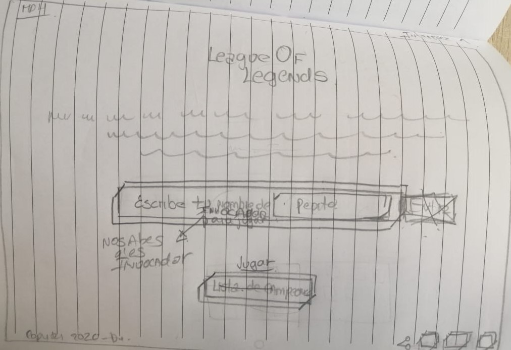
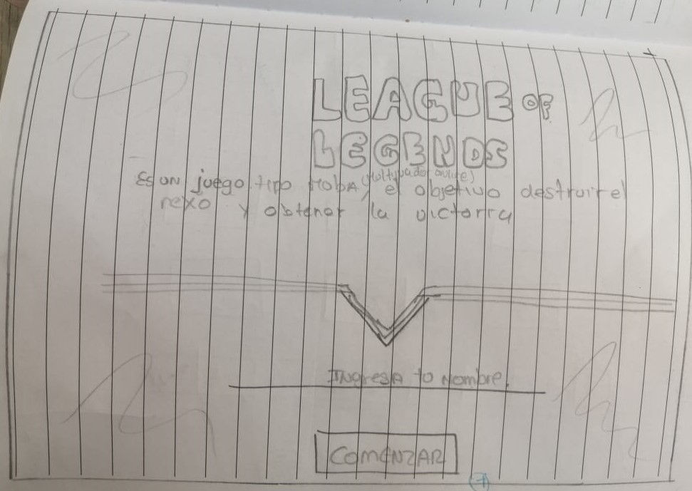
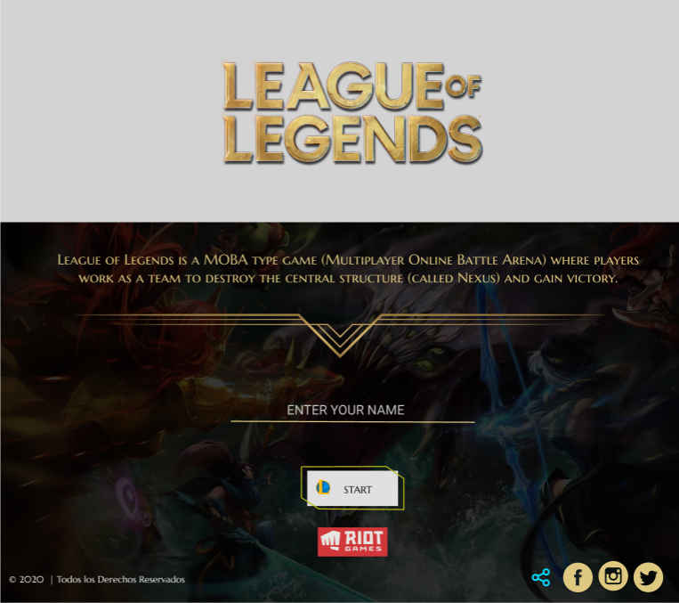
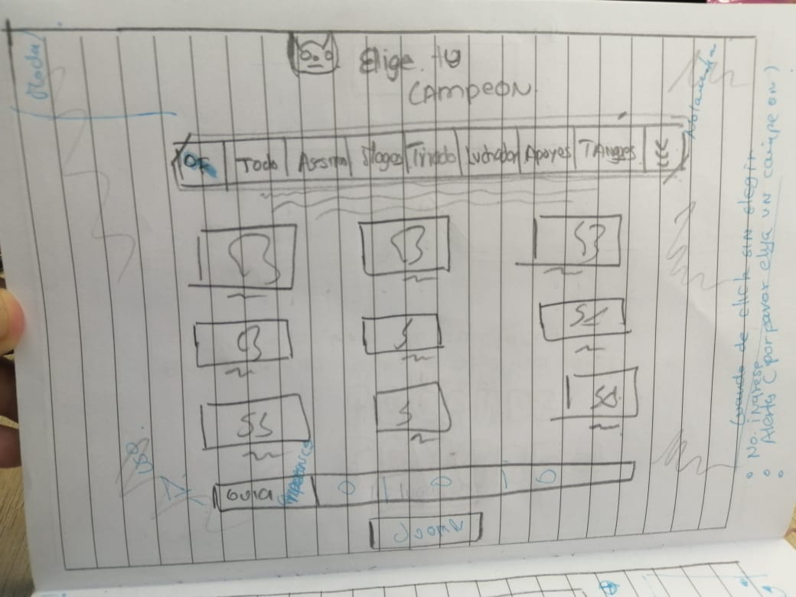
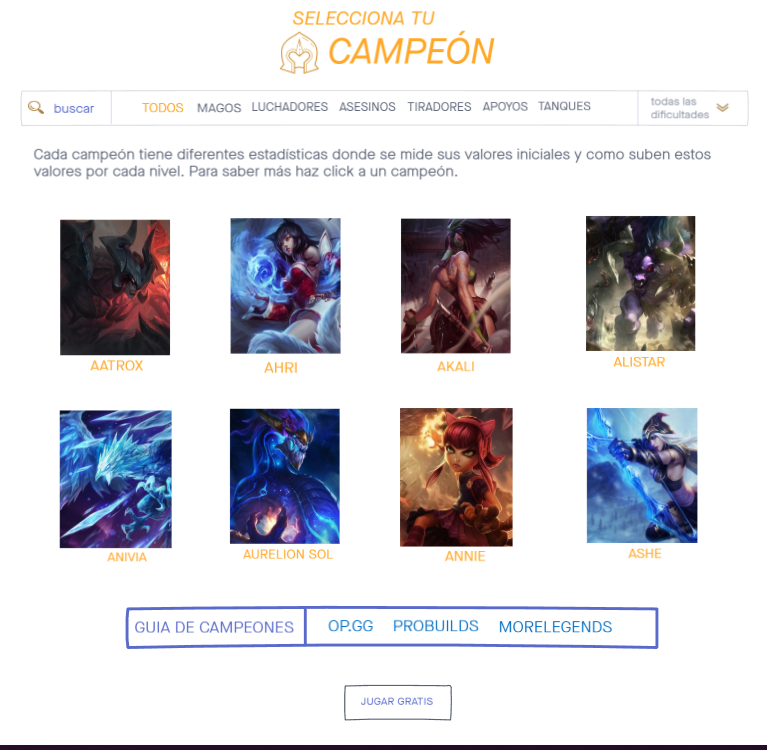
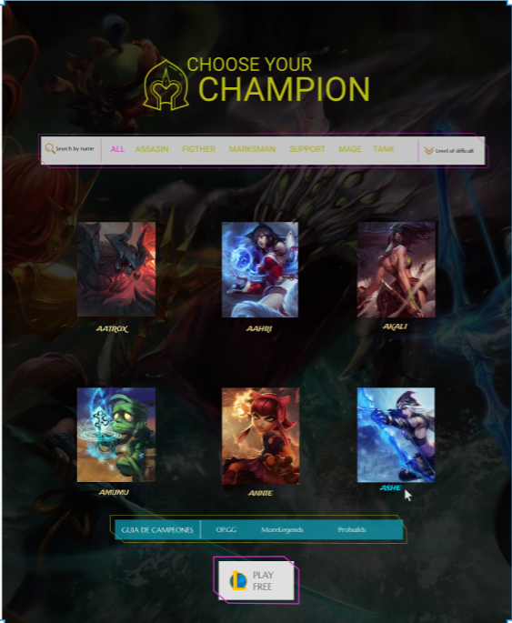

# Definición del producto DIGITAL: 💻


## Investigación UX: ✏️
 
Es una página web que permite al usuari@ (entre nuevos y experimentados), poder filtrar y ordenar una lista de campeones de **League of Legends** para seleccionar uno en específico y ver sus estadísticas generales (more stats) y principales (ataque, defensa, magia y dicultad), 
todo esto con el objetivo de tener un campeón con mayor ventaja que otro.[Planning 👉Trello](https://trello.com/b/ZbxxiHvY/datalovers)
                                             

`¿Quienes son los principales usuarios del producto?`
<br>
Jugador@s de esports (deporte electrónico) que no conocen el juego, entre 10 y 30 años de edad (no excluyente) 
interesados en el modo de juego MOBA (Multiplayer Online Battle Arena).

`¿Cuáles son los objetivos de estos usuarios en relación con el producto?`
<br>
El objetivo de estos invocadores (usuarios dentro del juego) es poder conocer las diferentes estadísticas de los más de 140 campeones del juego,
para crear estratégias que les permita llevarse la victoria en la grieta (campo de batalla).

`¿Cuáles son los datos mas importantes que quieren ver en la interfaz y por qué?`
<br>
* Para los nuevos usuarios que les indique las categorias de como seleccionar entre asesinos magos ,etc. Verlos por 
  imagen y ver sus atributos tambien (los principales).<br>
* Para usuarios experimentados son una barra para filtrar y ordenar la información de los campeones tales cómo:<br>
<br>
        Atack: 3,defense: 4,magic: 8, difficulty: 5, ovespeed: 350, armor: 26.38, étc.<br>
<br>

`¿Cuáles son los objetivos de estos usuarios en relación con el producto?`
<br>
Su objetivo es seleccionar un campeón de acuerdo a su gusto y características para iniciar el juego.

`¿Cuándo utilizan o utilizarían el producto?`
<br>
A la hora de planear una estrategia de juego, para conocer mejor a su campeón y poder acceder a los datos de sus counters, 
y finalmente como hacen sinergia distintos campeones para conformar el mejor equipo. Los usuarios solemos buscar los 
stats de nuestro equipo enemigo cuando estamos en pantalla de carga, antes de iniciar la partida.

***************************************
```js
HISTORIA DE USUARIO 1 (H.U.1): 
```

**HU1**: Pantalla de inicio : COMO jugador@ de lol QUIERO leer una breve descripción del juego e ingresar mi nombre, PARA sentir la 
experiencia más personalizada y tener una idea general de que trata el juego.

**Criterios de aceptación:** 🤔
<br>
-Que el usuario visualice una pantalla de inicio.<br>
-Que el usuario pueda ingresar su nombre en un campo (input).<br>
-Que el usuario pueda darle click a un botón que lo dirija a una siguiente pagina donde vera un listado de campeones.

**Definición de terminado:** ✔ 
<br>
-Utilizar Html semántico.<br>
-Hacerle testing al resultado.<br>
-Pagina responsive con felxbox grid.<br>
-Usar lint para evaluación de código (correcciones de sintaxis).<br>
-Subir a github <br>
-Desplegar en Git hub pagues.<br>



**FEEDBACK coaches** : 

1. Nos dijeron que definieramos mejor lo que nosotras como desarrolladoras definimos como Terminado.
2. Separas en dos HU estilos de CSS, de las funciones JS.
3. Nos sugirio pedirle feedback a Anahi.

**Testing con usuarios** :

1. Al inicio no entendían (como figura en la primera HU) que era LOL.
2. Resaltaron no entender que era un invocador (por lo que cambiamos el término como 'ingrese su nombre') 
3. Resaltaron no ver un botón de start, y no entendían el botón de listado de campeones por lo que optamos
   en colocar un solo botón de start que los dirija a otra página donde en una etiqueta se dijera que elijan a un 
   campeón.
4. El testing de la primera HU pasó testing de la mayoría de usuarios.

## Prototipado BAJA FIDELIDAD 
[VER 👉 INVISION](https://mararodriguez597039.invisionapp.com/freehand/datalovers-lol-AYIeTKBpY?v=X6JP0IPtqctW100IADvc3w%3D%3D&linkshare=urlcopied)



## Prototipado ALTA FIDELIDAD 
[VER 👉 FIGMA](https://www.figma.com/file/lr2q13Jdqztgdy6ag3oV7a/Untitled?node-id=77%3A177)




**********************************
```js
HISTORIA DE USUARIO 2 (H.U.2):
```

**HU2**:  Visualizar lista de campeones : Como jugador@ de lol quiero visualizar una lista de campeones para ver 
todos los campeones disponibles por nombre en orden alfabético 

**Criterios de aceptación:** 🤔<br>

-Visualizar una lista de campeones con su nombre e imagen<br>
-Se organizan todos los campeones en orden alfabético de la A a la Z (por defecto de la data) <br>
-Tiene la vista de la barra de búsqueda icono de buscar con todas las clases <br>
 de campeones a elegir, icono de nivel de dificultad  (sin funcionalidad)<br>


**Definición de terminado:** ✔ <br>

-Utilizar Html semántico.<br>
-Hacerle testing al resultado (Pruebas unitarias)<br>
-Pagina responsive con felxbox grid.<br>
-Usar lint para evaluación de código (correcciones de sintaxis).<br>
-Refactorizar <br>
-Subir a github <br>
hola caracol 
haoasjahskjahskjahs
-Desplegar en Git hub pagues.<br>




**FEEDBACK coaches** : 

<!-- 1. Nos dijeron que definieramos mejor lo que nosotras como desarrolladoras definimos como Terminado.
2. Separas en dos HU estilos de CSS, de las funciones JS. -->

**Testing con usuarios** :

<!-- 1. Al inicio no entendian (como figura en la primera HU) que era LOL.
2. Resaltaron no entender que era un invocador (por lo que cambiamos el termino como ingrese su nombre) 
3. Realtaron no ver un boton de start, y no entendian el boton de listado de campeones por lo que optamos
   en colocar un solo boton de start que los dirija a otra pagina donde en una etiqueta se dijera que elijan a un 
   campeon.
4. El testing de la primera HU pasó testing de la mayoría de usuarios. -->

## Prototipado BAJA FIDELIDAD 



## Prototipado ALTA FIDELIDAD 



********************************


