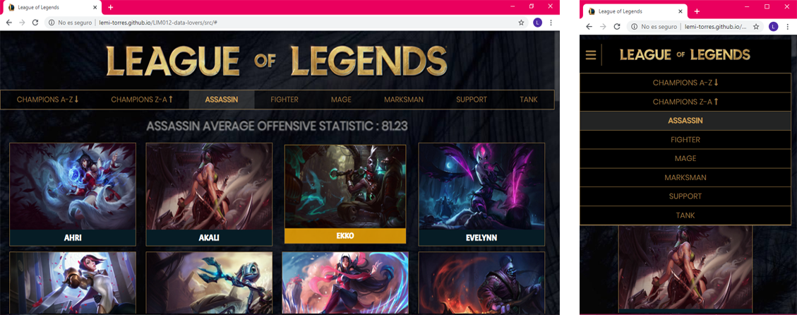
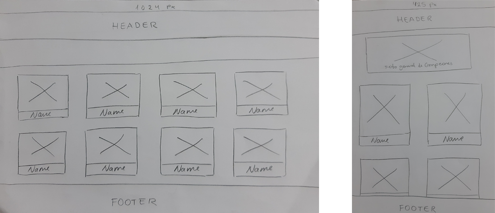
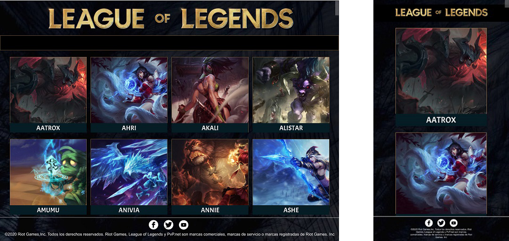
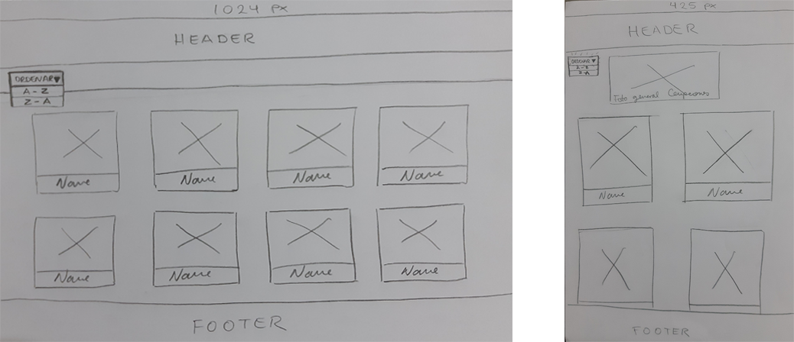
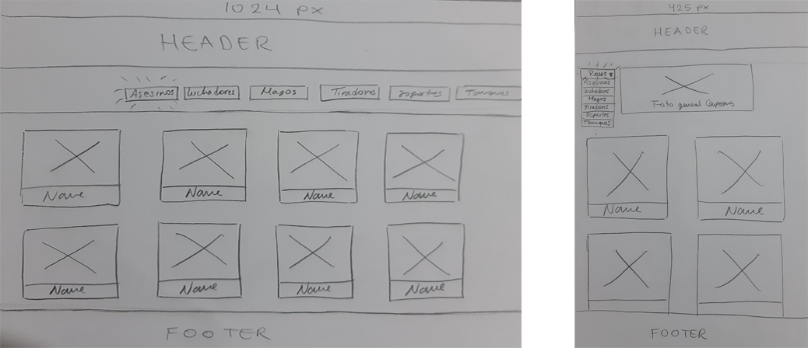
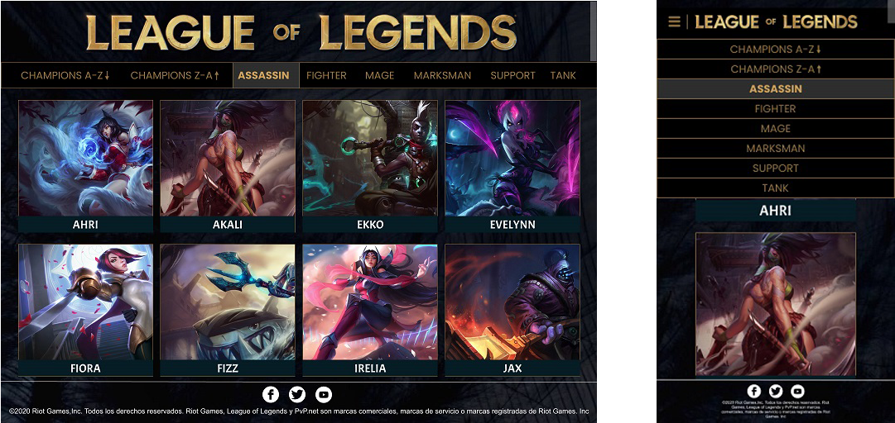
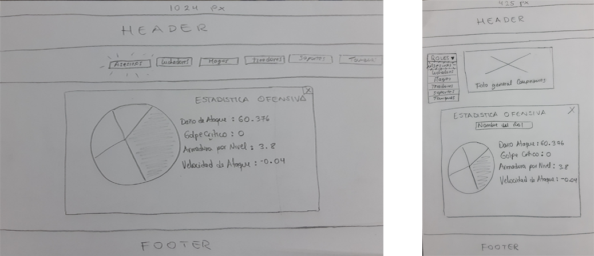
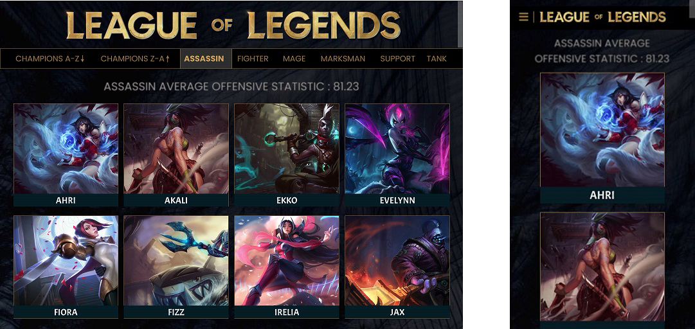

# PROYECTO : Data Lovers

# DATA ELEGIDA: League of Legends (Lol)

## Índice

* [1. Resumen del proyecto](#1-resumen-del-proyecto)
* [2. Definición del producto](#2-definición-del-producto)
* [3. Historias de usuario](#3-Historias-de-usuario)
* [4. Objetivos de aprendizaje](#4-objetivos-de-aprendizaje)
* [5. Checklist](#5-checklist)

***

## 1. Resumen del proyecto

 La pagina web fue diseñada basandose en la informacion obtenida del juego League of Legends y del tipo d usuario que conoce de este juego.Lol tiene como atractivo principal a sus personajes,los que son conocidos por los jugadores como "campeones",cada uno de ellos tienen ciertas caracteristicas que los diferencian a unos de otros y cada uno de estos detalles son determinantes para el jugador de Lol(invocador) ya que basandose en la informacion que pueda obtener de cada uno de ellos podra decidir quienes serian los campeones que conformarian su equipo para ser llevados a una partida.

# IMAGEN FINAL DEL PROYECTO.
✔ Diseño Responsive

## 2. Definición del producto
Nuestro proceso de diseño hacia el producto final comenzo por entender los hallazgos de la investigacion UX.
Primero debimos conocer y entender que era importante para nuestro usuario y de que manera les seria util nuestra pagina web.

### INVESTIGACIÓN UX:
- ¿Quiénes son los principales usuarios del producto?
Jugadores que ya conocen el concepto principal del juego , y estan interesados en conoceer cada vez mas a cada campeon para tomar decisiones correctas antes del juego.

- ¿Cuáles son los objetivos de estos usuarios en relación con el producto?
Necesitan informacion concisa sobre cada campeon para tener una idea clara y saber con cuales jugar y poder derrotar al enemigo.

- ¿Cuáles son los datos más relevantes que quieren ver en la interfaz y por qué?
Poder conocerlos y saber sus nombres ya que se les hace dificlil recordarlos por la gran cantidad que hay.
Tener la opcion de poder ordenar de manera ascendente o descendente a los campeones, ya que si ya saben a quien estan buscando pero solo recuerdan la inicial de su letra eso les ayudaría un poco a agilizar la busqueda.
Saber quienes son los campeones que pertenecen a determinado rol para poder ubicarlos en cada campo de batalla.

- ¿Cuándo utilizan o utilizarían el producto?
Antes de iniciar una partida, ya que ellos primero eligen a los campeones para poder definir su estilo de juego.

## 3. Historias de usuario
En el Trello confeccionamos columnas que simulaban la metodologia agil(product backlog, sprint backlog, haciendo, bloqueado y concluido) y diseñamos las Historias de Usuarios (#4 H.U en total).

Aquí el link : (https://trello.com/b/pyihIYEx/flujo-de-lol)

Diseñamos distintos prototipos de baja fidelidad (con lapiz y papel) que testeamos con posibles usuarios mediante el testeo de usabilidad, recibiendo feedback que nos ayudo a afinar nuestras HU iniciales y es por ellos que a medida que se fue avanzando con la parte de la funcionalidad, el proyecto fue cambiando visualmente con respecto a como fue concebido inicialmente en los prototipos de baja fidelidad. En las ferias de proyecto obtuvimos feedback tecnico que contribuia a la mejora de la pagina web y ademas se continuo testeando con usuarios potenciales para conocer que tan intuitiva era la pagina web.Adicional al diseño de Interfaz de usuario nuestras historias contienen la implementación requerida(HTML/CSS/JS).
Nuestro proyecto puede MOSTRAR, ORDENAR, FILTRAR y tiene un CÁLCULO.

### 1° HISTORIA DE USUARIO

YO COMO: jugador de LOL, QUIERO: ver a todos los campeones (imagen y nombre), PARA: Conocerlos e identificarme por su apariencia.

#### ✔ CRITERIOS DE ACEPTACION:
- El usuario podrá observar las imágenes y nombres de los campeones desde cualquier dispositivo.
- El usuario podrá ver la pagina web en Internet (desplegado GitHub).

#### ✔ DEFINICION DE TERMINADO:
- Prototipo de alta definición en programa de diseño UX.
- Crear una página Responsive.
- Publicación de proyecto en GitHub.
- Subir detalles al Readme.

#### ✔ PROTOTIPO DE BAJA FIDELIDAD:

#### ✔ PROTOTIPO DE ALTA FIDELIDAD:

### 2° HISTORIA DE USUARIO

YO COMO: jugador de LOL, QUIERO: ver a todos los campeones (imagen y nombre)ordenados alfabéticamente, PARA: que la búsqueda se me haga mas fácil.

#### ✔ CRITERIOS DE ACEPTACION:
- El usuario observará dos opciones, uno para ordenar de manera ascendente y descendente.
- El usuario al selecionar un orden podrá ver a todos los campeones alfabeticamente ordenados segun la opcion elegida.
- El usuario observará las imágenes y nombres de los campeones ordenados desde cualquier dispositivo.
- El usuario podrá ver la página web en Internet (desplegado GitHub).

#### ✔ DEFINICION DE TERMINADO:
- Prototipo de alta definición en programa de diseño UX.
- Crear una página Responsive
- Publicación de proyecto en GitHub
- Subir detalles al Readme.

#### ✔ PROTOTIPO DE BAJA FIDELIDAD:

#### ✔ PROTOTIPO DE ALTA FIDELIDAD:

### 3° HISTORIA DE USUARIO

YO COMO: jugador de LOL, QUIERO: filtrar por rol a cada campeón, PARA: poder conocer el estilo de juego de los campeones.

#### ✔ CRITERIOS DE ACEPTACION:
- El usuario observará las opciones que hay de cada rol en una barra superior de navegacion.
- El usuario podrá filtrar el rol del campeón al pulsar una de las opciones.
- El usuario podrá filtrar a los campeones por roles desde cualquier dispositivo.
- El usuario podrá ver la página web en Internet (desplegado GitHub).

#### ✔ DEFINICION DE TERMINADO:
- Prototipo de alta definición en programa de diseño UX.
- Crear una página Responsive
- Publicación de proyecto en GitHub
- Subir detalles al Readme.

#### ✔ PROTOTIPO DE BAJA FIDELIDAD:

#### ✔ PROTOTIPO DE ALTA FIDELIDAD:

### 4° HISTORIA DE USUARIO

YO COMO: jugador de LOL, QUIERO: conocer la estadística ofensiva de los campeones que pertenecen al rol que elija de manera global, PARA: para saber que tipo de daño físico pueden infligir al enemigo.

#### ✔ CRITERIOS DE ACEPTACION:
- El usuario al elegir el rol que desee podra ver el promedio general de Estadistica ofensiva.
- El usuario solo podra ver esta informacion dentro deprototipo-baja estas opciones unicamente.
- El usuario podrá realizar esta acción desde cualquier dispositivo.

#### ✔ DEFINICION DE TERMINADO:
- Prototipo de alta definición en programa de diseño UX.
- Crear una página Responsive
- Publicación de proyecto en GitHub
- Subir detalles al Readme.

#### ✔ PROTOTIPO DE BAJA FIDELIDAD:

#### ✔ PROTOTIPO DE ALTA FIDELIDAD:

 

## 4. Objetivos de aprendizaje

### UX

- [ ] Diseñar la aplicación pensando y entendiendo al usuario.
- [ ] Crear prototipos para obtener _feedback_ e iterar.
- [ ] Aplicar los principios de diseño visual (contraste, alineación, jerarquía).
- [ ] Planear y ejecutar _tests_ de usabilidad.

### HTML y CSS

- [ ] Entender y reconocer por qué es importante el HTML semántico.
- [ ] Identificar y entender tipos de selectores en CSS.
- [ ] Entender como funciona `flexbox` en CSS.
- [ ] Construir tu aplicación respetando el diseño planeado (maquetación).

### DOM

- [ ] Entender y reconocer los selectores del DOM (`querySelector` | `querySelectorAll`).
- [ ] Manejar eventos del DOM. (`addEventListener`)
- [ ] Manipular dinámicamente el DOM. (`createElement`, `appendchild`, `innerHTML`, `value`)

### Javascript

- [ ] Manipular arrays (`filter` | `map` | `sort` | `reduce`).
- [ ] Manipular objects (key | value).
- [ ] Entender el uso de condicionales (`if-else` | `switch`).
- [ ] Entender el uso de bucles (`for` | `forEach`).
- [ ] Entender la diferencia entre expression y statements.
- [ ] Utilizar funciones (`parámetros` | `argumentos` | `valor de retorno`).
- [ ] Entender la diferencia entre tipos de datos atómicos y estructurados.
- [ ] Utilizar ES Modules (`import` | `export`).

### Pruebas Unitarias (_testing_)
- [ ] Testear funciones (funciones puras).

### Git y GitHub
- [ ] Ejecutar comandos de git (`add` | `commit` | `pull` | `status` | `push`).
- [ ] Utilizar los repositorios de GitHub (`clone` | `fork` | `gh-pages`).
- [ ] Colaborar en Github (`pull requests`).

### Buenas prácticas de desarrollo
- [ ] Organizar y dividir el código en módulos (Modularización).
- [ ] Utilizar identificadores descriptivos (Nomenclatura | Semántica).
- [ ] Utilizar linter para seguir buenas prácticas (ESLINT).

## 5. Checklist

* [ ] Usa VanillaJS.
* [ ] No hace uso de `this`.
* [ ] Pasa linter (`npm run pretest`)
* [ ] Pasa tests (`npm test`)
* [ ] Pruebas unitarias cubren un mínimo del 70% de statements, functions y
  lines y branches.
* [ ] Incluye _Definición del producto_ clara e informativa en `README.md`.
* [ ] Incluye historias de usuario en `README.md`.
* [ ] Incluye _sketch_ de la solución (prototipo de baja fidelidad) en
  `README.md`.
* [ ] Incluye _Diseño de la Interfaz de Usuario_ (prototipo de alta fidelidad)
  en `README.md`.
* [ ] Incluye link a Zeplin en `README.md`.
* [ ] Incluye el listado de problemas que detectaste a través de tests de
  usabilidad en el `README.md`.
* [ ] UI: Muestra lista y/o tabla con datos y/o indicadores.
* [ ] UI: Permite ordenar data por uno o más campos (asc y desc).
* [ ] UI: Permite filtrar data en base a una condición.
* [ ] UI: Es _responsive_.