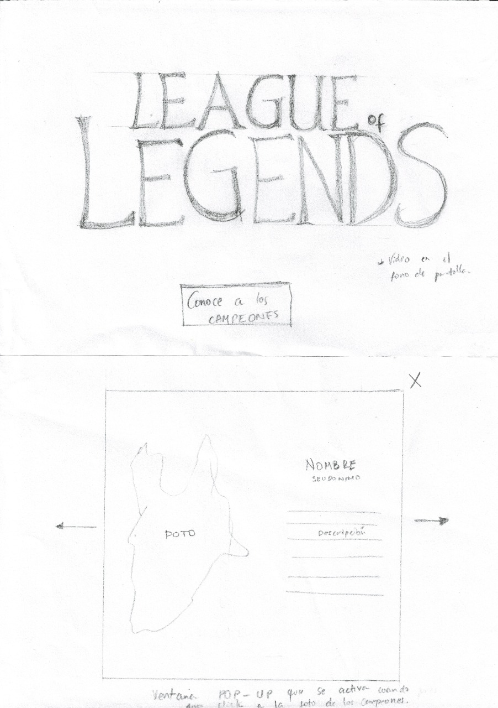
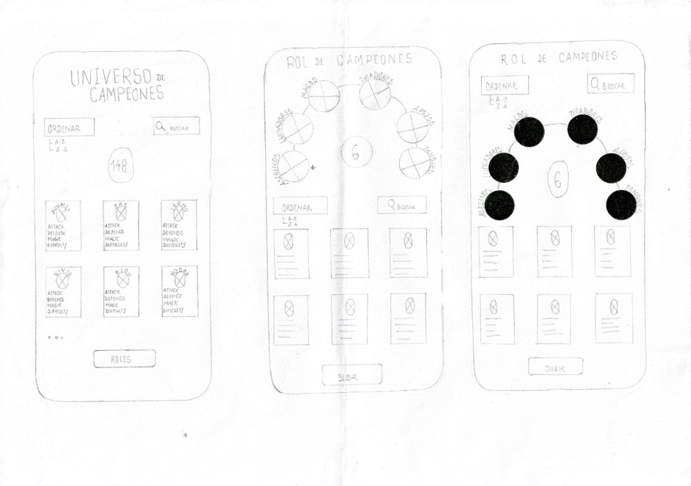
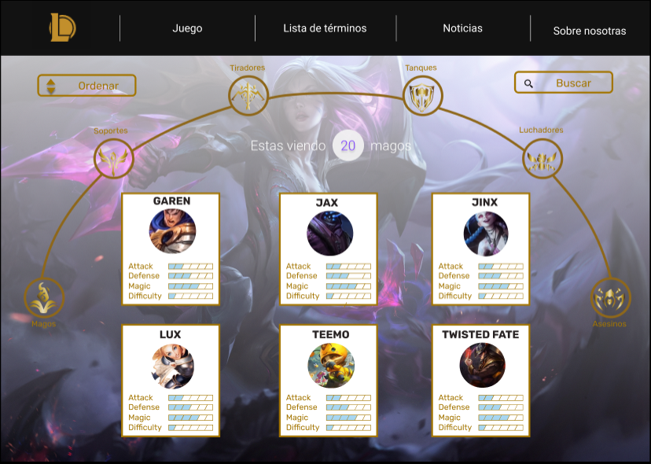
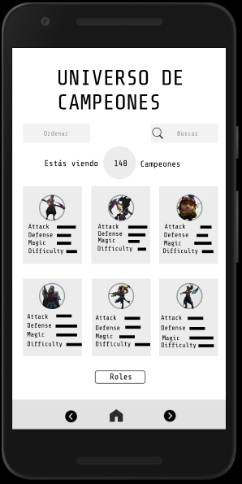
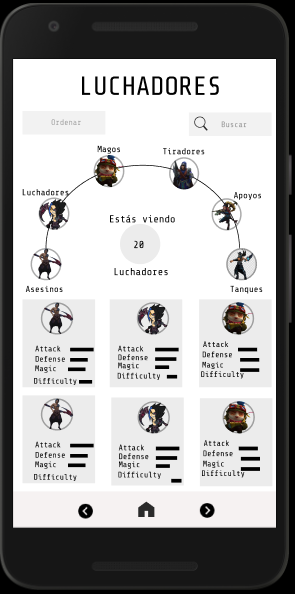
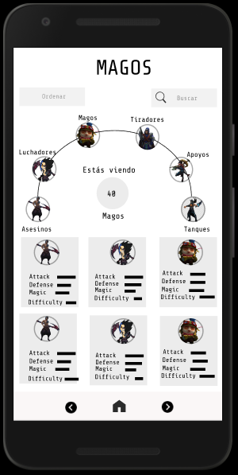
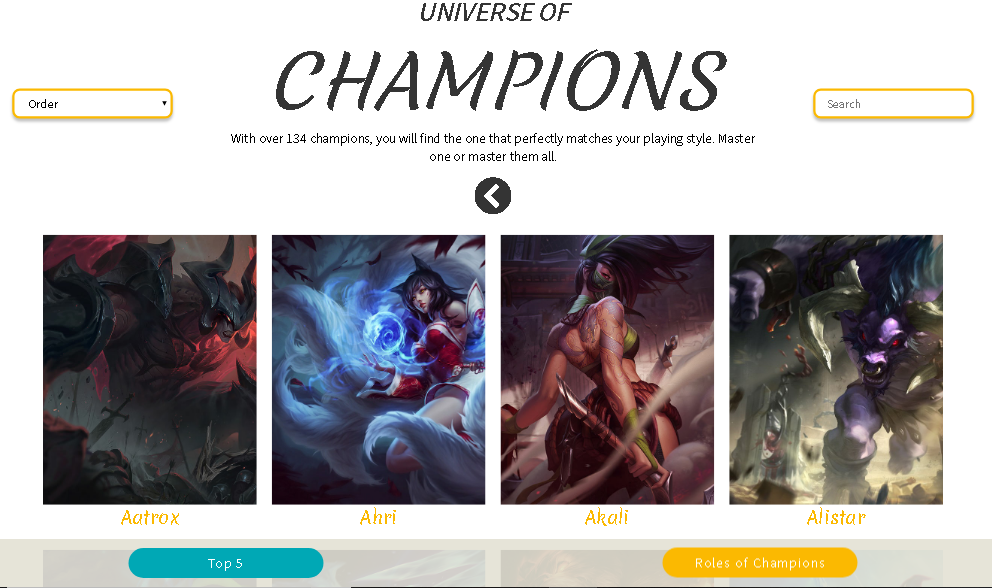

# <**LEAGUE OF LEGENDS - DATALOVERS LABORATORIA**>

### 🕵🏼‍♀️ **DEFINICIÓN DEL PRODUCTO** 👩🏻‍🏫
Es una página web muy interactiva para el público en general que desea conocer más acerca del juego League Of Legends
que al ingresar a la página web, lo primero que va hacer el usuari@ es ver una barra de navegación donde tiene: **GAME** (Donde si el usuario desea saber más acerca de este juego puede pulsar ahí y se abrirá lap página oficial de LOL [GAME](https://euw.leagueoflegends.com/es-es/how-to-play/) ), **LIST OF TERMS** (En esta parte el usuari@ puede ver más acerca de los términos que se manejan en el juego [LIST OF TERMS](https://league-of-legends-lol.fandom.com/es/wiki/Diccionario_de_Terminos_del_LoL) ), **NEWS** (En esta parte el usuari@ puede ver noticias de último minuto acerca de LOL [NEWS](https://esports.as.com/league-of-legends/) ) y **ABOUT US** (Aquí se puede ver más acerca de las desarrolladoras de esta página web 👩🏼‍💻[®️RUTH CAMPOS](https://github.com/RLCHuncp) && 👩🏼‍💻[®️ROSMERY TERRY](https://github.com/rosterry58).

✍🏽`USUARIOS:`
Los principales usuarios de nuestra página web son para personas que son aficionad@s a los videojuegos especialmente del género multijugador de arena de batalla  en Línea (MOBA) y deporte electrónico.
 

✍🏽`SOLUCIÓN:`
Es brindar todo los campeones con sus respectivo información adicional que cada uno de los 134 campeones tiene, de igual manera el usuari@ al ingresar a la página web al hacer click en roles de campeones va a visualizar segun los tags que tiene cada uno de ellos y dentro de ello puede ordenar de manera ascendente y descendente como también puede buscar por nombres al campeón que desea ver a más detalle y por último se puede observar a los 5 mejores campeones según su estadística defensiva.
 

✍🏽`OBJETIVO:`
Brindar la información más completa posible del juego (League Of Legends) y sus campeones y que les permita tener una mejor selección a la hora de jugar y ser mejor en el juego.

### **HISTORIAS DE USUARIO**
**HU1 - INICIO**: 
🔸Yo COMO usuario.  
🔸QUIERO ver un vídeo como fondo de pantalla.  
🔸PARA tener una noción de qué trata el juego. 
 
**🔗CRITERIOS DE ACEPTACIÓN:** 
➖El usuario puede ver un fondo con imágenes en movimiento. 
➖El usuario puede hacer click en el botón conoce a los campeones para ir a la lista de los campeones. 
➖El usuario puede dar click a los botones de la barra de navegación y les llevará a páginas con información que indica en los botones. 
 
**🔗DEFINICIÓN DETERMINADO:** 
➖La barra de navegación contiene los links de las páginas a las que se va a derivar. 
➖El fondo tiene imágenes con slider. 
➖La barra de navegación tiene un hover de color dorado. 
➖La pagina se trabajó con flexbox y es responsive. 
➖Cuando se reduce el ancho de la pantalla (versión móvil) la barra de navegación se convierte en botón hamburguesa. 
➖El footer tienes los botones de las redes sociales que están linkeados a las redes sociales oficiales de LOL. 
 
**HU2 - LISTA DE CAMPEONES**  
🔸Yo COMO usuario. 
🔸QUIERO ver una lista completa de los campeones. 
🔸PARA conocer la variedad que existe. 
 
**🔗CRITERIOS DE ACEPTACIÓN:**
➖El usuario puede ver la lista completa de los campeones en la pantalla con sus respectivas imágenes, nombres e dificultad. 
➖El usuario puede hacer click en la imagen del campeón y aparece una ventana pop up con la información del campeón. 
➖El usuario puede ver un footer con dos botones: Top5 y Roles de campeones. 
➖El usuario puede ver la dificultad de los campeones. 

**🔗DEFINICIÓN DE TERMINADO:**
➖Se muestran filas de 4 campeones. 
➖Se muestra la imagen, nombre y dificultad. 
➖Se muestra un cálculo matemático. 
➖Se muestra la ventana pop up con info, title y blurb. 
➖Se trabajó con flexbox y es responsive. 
➖Se muestra un footer con nav fijado y los botones de Top5 y roles de campeones. 
➖Se ve un rectángulo con transparencia y encima se muestra la palabra dificultad y el gráfico. 
 
**HU3 - BUSCADOR:** 
🔸Yo COMO usuario.  
🔸QUIERO ver el buscador en la pantalla principal. 
🔸PARA encontrar a los campeones con cualquier letra que contiene en su nombre. 

**🔗CRITERIOS DE ACEPTACIÓN:** 
➖El usuario puede escribir una letra y se filtra todo los campeones que contienen esa letra. 
➖El usuario puede escribir una letra mayúscula o minúscula. 
➖El campo de buscador no permite ingresar números. 

**🔗DEFINICIÓN DE TERMINADO:** 
➖Se muestra un buscador en la parte superior derecha, y que al digitar una letra el usuario puede visualizar a todo los capeones que contienen la letra digitada en su nombre, y de acuerdo a ello filtrar. 

**HU4 - ORDENAR:** 
🔸Yo como usuario. 
🔸QUIERO tener un botón. 
🔸PARA ordenar de forma ascendente o descendente a toda la lista de campeones. 

**🔗CRITERIOS DE ACEPTACIÓN:** 
El usuario al hacer click en el botón ordenar: 
➖Puede deslizar y observa "Ascendente" y "Descendente". 
➖Al hacer click en ascendente el usuario puede observar a todos los campeones que se ordenan de A-Z. 
➖Al hacer click en descendente el usario puede observar a todo los campeones ordenadose de Z-A. 

**🔗DEFINICIÓN DE TERMINADO:** 
➖Se muestra una barra vertical con dos opciones (Ascending y Descending) 

**HU5: ROLES DE CAMPEONES.** 
🔸Yo como usuario. 
🔸quiero filtrar los campeones según los roles.  
🔸para elegir mejor a mi equipo. 

**🔗CRITERIOS DE ACEPTACIÓN:** 
➖El usuario podrá ver una lista con el ícono de cada rol. 
➖El usuario puede hacer click en el ícono y se desplegará una lista por roles. 
➖En la pantalla se podrá ver la cantidad de campeones filtrados por roles. 

**HISTORIAS DE USUARIO - ADICIONALES AL FUNCIONAMIENTO** 

**HU - Habilidades de campeones** 
🔸YO como usuario. 
🔸QUIERO conocer las habilidades que tiene los campeones. 
🔸PARA elegir mi equipo. 

**🔗DEFINICIÓN DE TERMINADO:** 
-Hacer test. 
-Pagina responsive . 
-Usar lint para evaluación de código (correcciones de sintaxis). 
-Subir a github 
-Desplegar en Github pages. 
**HU - Habilidades de campeones** 
🔸YO como principiante. 
🔸QUIERO saber qué niveles existen. 
🔸PARA elegir a mis campeones. 

**HU - lista de términos** 
🔸YO como principiante.  
🔸QUIERO ver la lista de los términos que se maneja en LoL. 
🔸PARA comprender el léxico que se maneja en el juego. 

**HU - Regresar a lista de campeones en general** 
🔸Yo como usuario. 
🔸QUIERO regresar a la anterior página. 
🔸PARA ver la lista general de los campeones. 

### **DISEÑO DE LA INTERFAZ DEL USUARIO**
#### PROTOTIPO DE BAJA FIDELIDAD
👇**PANTALLA PRINCIPAL**

👇**LISTA DE LOS CAMPEONES - SEGUNDA PANTALLA**

👇**PROTOTIPO MOBILE**

#### PROTOTIPO DE ALTA FIDELIDAD
[👉💻Prototipo desktop - FIGMA💻👈](https://www.figma.com/proto/AQJDr5M9kjxbFeFuR0gsQ3/Untitled?node-id=1%3A2&viewport=-2698%2C429%2C0.5&scaling=scale-down) 

[👉📲Prototipo Mobile - FIGMA📲👈-B/N](https://www.figma.com/proto/5OaEmh2eXexJBTFCbK50ii/Prototipo-LoL-M%C3%B3vil---B%2FN?node-id=11%3A0&viewport=232%2C266%2C0.2997128367424011&scaling=scale-down) 
[👉📲Prototipo Mobile - FIGMA📲👈-COLORES](https://www.figma.com/proto/zCbxb1dfeT32XZEBW8baz3/Untitled?node-id=1%3A706&viewport=443%2C326%2C0.2997128367424011&scaling=contain) 
**BLANCO Y NEGRO** 

### **Implementación de la Interfaz de Usuario (HTML/CSS/JS)**

1. La interfaz que se muestra en la siguiente figura, se observa la lista de campeones. 

2. La interfaz permite al usuario interactuar para obtener la información, ya sea a través de los botones del buscador, o seleccionando de manera Ascendente o descendente.

3. Es _responsive_, es decir, debe visualizarse sin problemas desde distintos
   tamaños de pantallas: móviles, tablets y desktops.

4. Que la interfaz siga los fundamentos de _visual design_.

### **OBJETIVOS DE APRENDIZAJE**
### **UX**

[✔️] Diseñar la aplicación pensando y entendiendo al usuario. 
[✔️] Crear prototipos para obtener _feedback_ e iterar. 
[✔️] Aplicar los principios de diseño visual (contraste, alineación, jerarquía). 
[ ] Planear y ejecutar _tests_ de usabilidad. 

### **HTML y CSS**
[✔️] Entender y reconocer por qué es importante el HTML semántico. 
[✔️] Identificar y entender tipos de selectores en CSS. 
[✔️] Entender como funciona `flexbox` en CSS. 
[✔️] Construir tu aplicación respetando el diseño planeado (maquetación). 

### **DOM**
[✔️] Entender y reconocer los selectores del DOM (`querySelector` | `querySelectorAll`). 
[✔️] Manejar eventos del DOM. (`addEventListener`) 
[✔️] Manipular dinámicamente el DOM. (`createElement`, `appendchild`, `innerHTML`, `value`) 

### **Javascript**
[✔️] Manipular arrays (`filter` | `map` | `sort` | `reduce`). 
[✔️] Manipular objects (key | value). 
[✔️] Entender el uso de condicionales (`if-else` | `switch`). 
[✔️] Entender el uso de bucles (`for` | `forEach`). 
[✔️] Entender la diferencia entre expression y statements. 
[✔️] Utilizar funciones (`parámetros` | `argumentos` | `valor de retorno`). 
[✔️] Entender la diferencia entre tipos de datos atómicos y estructurados. 
[✔️] Utilizar ES Modules (`import` | `export`). 

### **Pruebas Unitarias (_testing_)** 
[✔️] Testear funciones (funciones puras). 

### **Git y GitHub**
[✔️] Ejecutar comandos de git (`add` | `commit` | `pull` | `status` | `push`). 
[✔️] Utilizar los repositorios de GitHub (`clone` | `fork` | `gh-pages`). 
[✔️] Colaborar en Github (`pull requests`). 

### **Buenas prácticas de desarrollo** 
[✔️] Organizar y dividir el código en módulos (Modularización). 
[✔️] Utilizar identificadores descriptivos (Nomenclatura | Semántica). 
[✔️] Utilizar linter para seguir buenas prácticas (ESLINT). 

### **PROPUESTAS DE MEJORA**
En futuras versiones de nuestra web planeamos agregar nuevo contenido a la página, utilizando la interacción de las [APIs de LOL](https://developer.riotgames.com/), las cuales nos permitiran mostrar información adicional como:

⌛️Mostrar (habilidades) de los champions. 
⌛️Consejos al usuario al jugar CON o CONTRA cada champion. 
⌛️Lo anterior permitirá complementar la información que contiene actualmente la página y dirigirla a lo que los usuarios creen útil y necesario de acuerdo a la encuesta realizada al inicio de nuestro proyecto, en la fase de definición del producto. 
⌛️Hacer PopUp a cada card. 

❗️❗️LINK DE NUESTRO PROYECTO - REVÍSALO 💯👉👉[AQUÍ]()❗️❗️