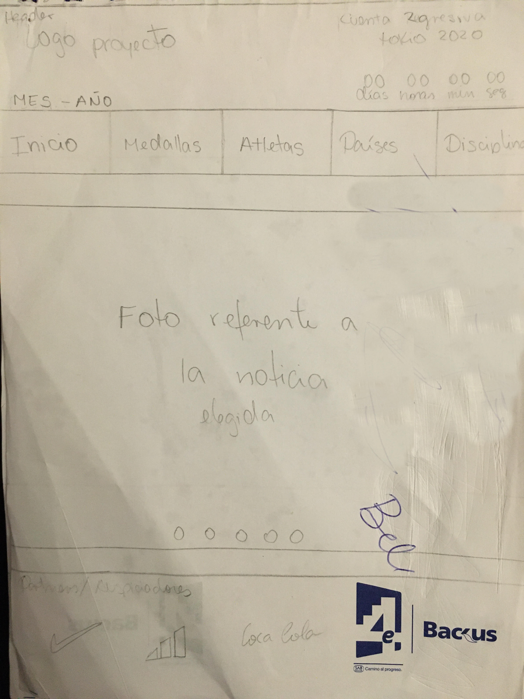
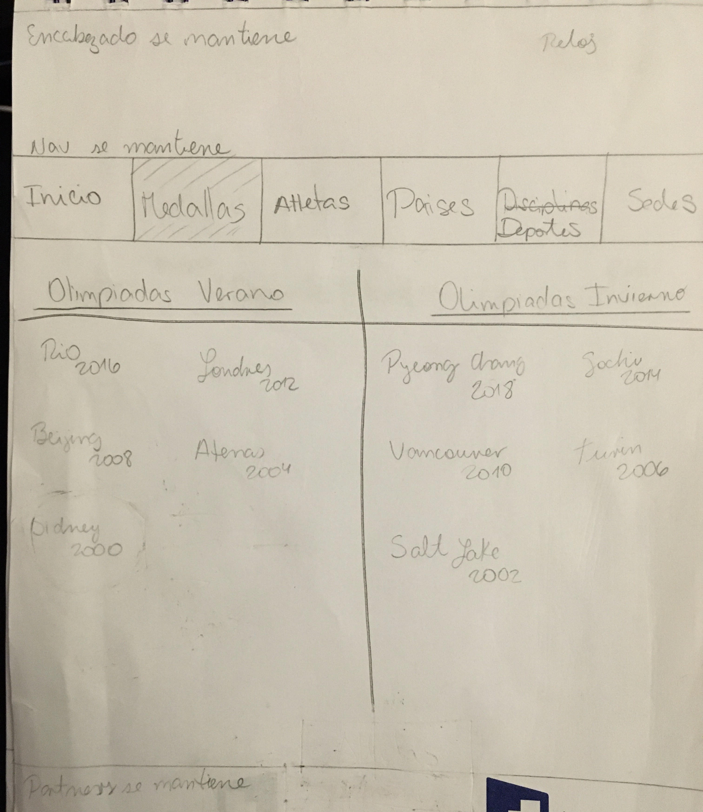
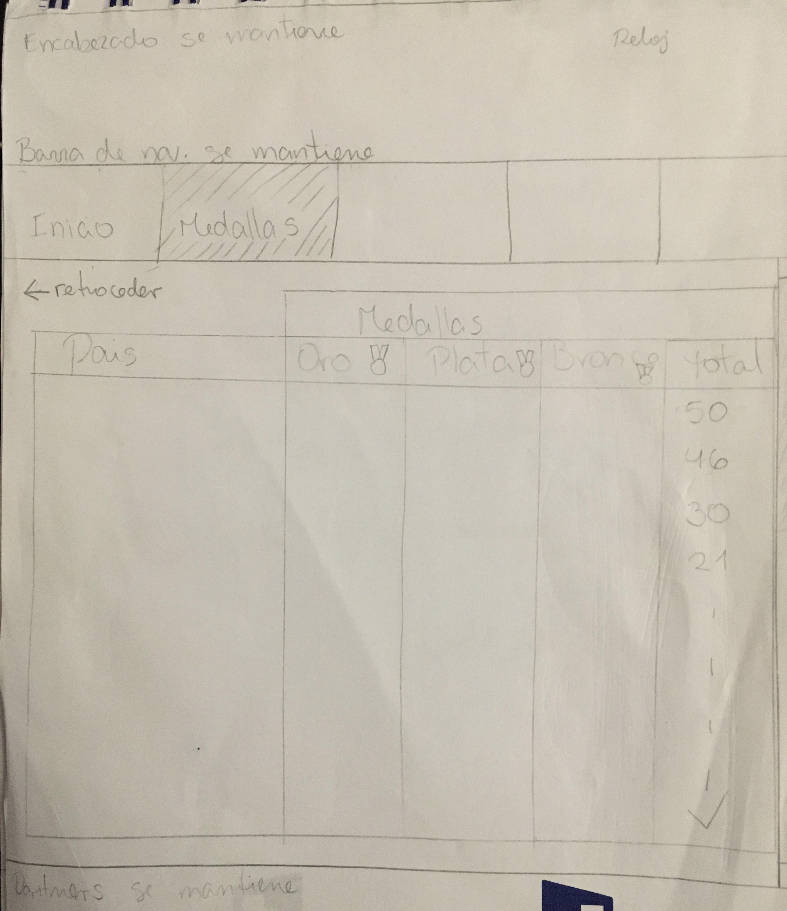
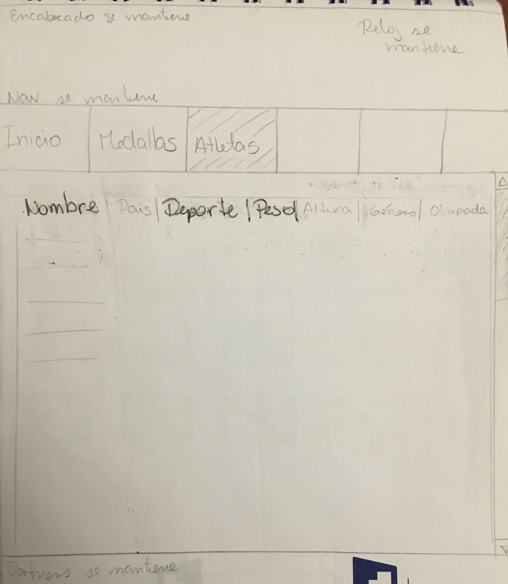

<<<<<<< HEAD

# 🏆**BOLETÍN OLÍMPICO**🏆

## **Definición del producto y público objetivo**
Últimas noticias, fotos, enlaces de interés y datos sobre la historia y participantes de las Olímpiadas, se encuentran en Boletín Olímpico.

Dirigida especialmente para facilitar información a los Atletas que se preparan para competencias de alto rendimiento, también puede ser usada por el público en general por la variedad de su contenido.
Esta web se actualiza de forma mensual añadiendo las últimas noticias sobre los Juegos Olímpicos en curso y por venir, también se podrá interactuar con una base de datos enfocada en los Atletas y su participación en Juegos Olimpicos de Verano e Invierno desarrollados entre los años 2000 al 2016.

## **Historias de Usuario**
Teniendo en cuenta las necesidades de nuestro publico objetivo se desarrollaron 7 Historias de Usuario con la finalidad de que Boletín Olímpico sea un sitio web interactivo y con la mayor cantidad de información posible.[Aquí podrás ver el detalle de cada una de ellas.](https://trello.com/b/Nr2P4XT0/base-atletas)

## Diseño de la Interfaz de Usuario
Desde siempre se consideró realizar una web con lineas y colores amigables a la vista, siempre teniendo en cuenta el tema central, JUEGOS OLIMPICOS.

=======
# BOLETÍN OLÍMPICO

## Definición del producto y público objetivo
Últimas noticias, fotos, enlaces de interés y datos sobre la historia y participantes de las Olímpiadas, se encuentran en Boletín Olímpico.

Dirigida especialmente para facilitar información a los Atletas que se preparan para competencias de alto rendimiento, también puede ser usada por el público en general por la variedad de su contenido.
Esta web se actualiza de forma mensual añadiendo las últimas noticias sobre los Juegos Olímpicos en curso y por venir, también se podrá interactuar con una base de datos enfocada en los Atletas y su participación en Juegos Olimpicos de Verano e Invierno desarrollados entre los años 2000 al 2016.

## Historias de Usuario
Teniendo en cuenta las necesidades de nuestro publico objetivo se desarrollaron 7 Historias de Usuario con la finalidad de que Boletín Olímpico sea un sitio web interactivo y con la mayor cantidad de información posible.[Aquí podrás ver el detalle de cada una de ellas.](https://trello.com/b/Nr2P4XT0/base-atletas)

## Diseño de la Interfaz de Usuario
Desde siempre se consideró realizar una web con lineas y colores amigables a la vista, siempre teniendo en cuenta el tema central, JUEGOS OLIMPICOS.

>>>>>>> 94d9c2d88838a9a8926aafdad314b53ce50e63d9
#### Prototipo de baja fidelidad
La web debía facilitar al usuario la interacción con la misma, es por ello que se opto por colocar un encabezado, una barra de navegación y un pie de página, los tres de forma fija, es decir siempre estarán visibles.

* La barra de navegación proporciona los diferentes enlaces que ofrece la página para la navegación.
* El encabezado muestra el nombre de la Web (proyecto), fecha de emisión del boletín y un reloj en cuenta regresiva hacia los siguientes Juegos Olímpicos, en este caso Tokio 2020.
* El pie de página muestra los patrocinadores de la página los cuales en su maypria son marcas reconocidas deportivas.

La parte central de la web será ocupada por la opción seleccionada por el usuario en la barra navegadora:

**Inicio**: Slider que muestra las noticias de mayor relevancia.
<<<<<<< HEAD

**Medallas**: Consta de dos interacciones. En la primera pantalla se muestra los logos de los Juegos Olimpicos separados por temporada (Verano/Invierno).

Al seleccionar la Olímpiada deseada se mostrará el medallero correspondiente ordenada por la cantidad de medallas obtenidas por cada país.

**Atletas**: Lista que muestra los datos mas importantes de todos los Atletas que participaron en los Juegos Olímpicos celebrados entre el año 2000 al 2016. Los datos se podrán ordenar en orden alfabetico.

=======

**Medallas**: Consta de dos interacciones. En la primera pantalla se muestra los logos de los Juegos Olimpicos separados por temporada (Verano/Invierno).

Al seleccionar la Olímpiada deseada se mostrará el medallero correspondiente ordenada por la cantidad de medallas obtenidas por cada país.

**Atletas**: Lista que muestra los datos mas importantes de todos los Atletas que participaron en los Juegos Olímpicos celebrados entre el año 2000 al 2016. Los datos se podrán ordenar en orden alfabetico.

>>>>>>> 94d9c2d88838a9a8926aafdad314b53ce50e63d9

**Sedes Olímpicas**: Se muestra los logos de los Juegos Olimpicos de Verano e Invierno, cada uno a modo de boton redirigirá al usuario a su propia web.

#### Prototipo de Alta fidelidad
Previa investigación se eligieron colores que no saturen a la vista, de por si el tema incluye 5 colores relacionados a los aros olimpicos, sin embargo solo se eligió el color verde en combinación con un azul neutro.
El prototipado del proyecto siempre se desarrolló a modo que cuando sea responsive no se altere el diseño del mismo.

## Objetivos de Aprendizaje

### UX

- [ ] Diseñar la aplicación pensando y entendiendo al usuario.
- [ ] Crear prototipos para obtener _feedback_ e iterar.
- [ ] Aplicar los principios de diseño visual (contraste, alineación, jerarquía).
- [ ] Planear y ejecutar _tests_ de usabilidad.

### HTML y CSS

- [ ] Entender y reconocer por qué es importante el HTML semántico.
- [ ] Identificar y entender tipos de selectores en CSS.
- [ ] Entender como funciona `flexbox` en CSS.
- [ ] Construir tu aplicación respetando el diseño planeado (maquetación).

### DOM

- [ ] Entender y reconocer los selectores del DOM (`querySelector` | `querySelectorAll`).
- [ ] Manejar eventos del DOM. (`addEventListener`)
- [ ] Manipular dinámicamente el DOM. (`createElement`, `appendchild`, `innerHTML`, `value`)

### Javascript

- [ ] Manipular arrays (`filter` | `map` | `sort` | `reduce`).
- [ ] Manipular objects (key | value).
- [ ] Entender el uso de condicionales (`if-else` | `switch`).
- [ ] Entender el uso de bucles (`for` | `forEach`).
- [ ] Entender la diferencia entre expression y statements.
- [ ] Utilizar funciones (`parámetros` | `argumentos` | `valor de retorno`).
- [ ] Entender la diferencia entre tipos de datos atómicos y estructurados.
- [ ] Utilizar ES Modules (`import` | `export`).

### Pruebas Unitarias (_testing_)
- [ ] Testear funciones (funciones puras).

### Git y GitHub
- [ ] Ejecutar comandos de git (`add` | `commit` | `pull` | `status` | `push`).
- [ ] Utilizar los repositorios de GitHub (`clone` | `fork` | `gh-pages`).
- [ ] Colaborar en Github (`pull requests`).

### Buenas prácticas de desarrollo
- [ ] Organizar y dividir el código en módulos (Modularización).
- [ ] Utilizar identificadores descriptivos (Nomenclatura | Semántica).
<<<<<<< HEAD
- [ ] Utilizar linter para seguir buenas prácticas (ESLINT).
=======
- [ ] Utilizar linter para seguir buenas prácticas (ESLINT).
>>>>>>> 94d9c2d88838a9a8926aafdad314b53ce50e63d9
