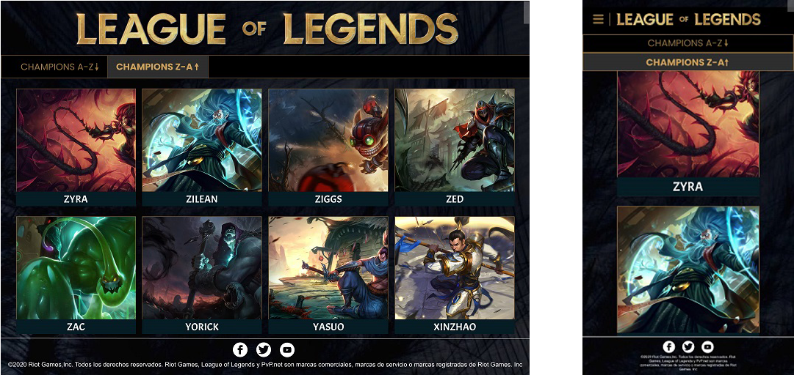

# PROYECTO : Data Lovers

# DATA ELEGIDA: League of Legends (Lol)

# RESUMEN DEL PROYECTO:
 La pagina web fue diseñada basandose en la informacion obtenida del juego League of Legends y del tipo d usuario que conoce de este juego.Lol tiene como atractivo principal a sus personajes,los que son conocidos por los jugadores como "campeones",cada uno de ellos tienen ciertas caracteristicas que los diferencian a unos de otros y cada uno de estos detalles son determinantes para el jugador de Lol(invocador) ya que basandose en la informacion que pueda obtener de cada uno de ellos podra decidir quienes serian los campeones que conformarian su equipo para ser llevados a una partida.

# IMAGEN FINAL DEL PROYECTO.
 
 link deskop
 link mobil

# DEFINICIÓN DEL PRODUCTO:
Nuestro proceso de diseño hacia el producto final comenzo por entender los hallazgos de la investigacion UX.
Primero debimos conocer y entender que era importante para nuestro usuario y de que manera les seria util nuestra pagina web.

# INVESTIGACIÓN UX:
- ¿Quiénes son los principales usuarios del producto?
Jugadores que ya conocen el concepto principal del juego , y estan interesados en conoceer cada vez mas a cada campeon para tomar decisiones correctas antes del juego.

- ¿Cuáles son los objetivos de estos usuarios en relación con el producto?
Necesitan informacion concisa sobre cada campeon para tener una idea clara y saber con cuales jugar y poder derrotar al enemigo.

- ¿Cuáles son los datos más relevantes que quieren ver en la interfaz y por qué?
Poder conocerlos y saber sus nombres ya que se les hace dificlil recordarlos por la gran cantidad que hay.
Tener la opcion de poder ordenar de manera ascendente o descendente a los campeones, ya que si ya saben a quien estan buscando pero solo recuerdan la inicial de su letra eso les ayudaría un poco a agilizar la busqueda.
Saber quienes son los campeones que pertenecen a determinado rol para poder ubicarlos en cada campo de batalla.

- ¿Cuándo utilizan o utilizarían el producto?
Antes de iniciar una partida, ya que ellos primero eligen a los campeones para poder definir su estilo de juego.

# HISTORIAS DE USUARIO:
En el Trello confeccionamos columnas que simulaban la metodologia agil(product backlog, sprint backlog, haciendo, bloqueado y concluido) y diseñamos las Historias de Usuarios (#4 H.U en total).

Aquí el link : (https://trello.com/b/pyihIYEx/flujo-de-lol)

Diseñamos distintos prototipos de baja fidelidad (con lapiz y papel) que testeamos con posibles usuarios mediante el testeo de usabilidad, recibiendo feedback que nos ayudo a afinar nuestras HU iniciales y es por ellos que a medida que se fue avanzando con la parte de la funcionalidad, el proyecto fue cambiando visualmente con respecto a como fue concebido inicialmente en los prototipos de baja fidelidad. En las ferias de proyecto obtuvimos feedback tecnico que contribuia a la mejora de la pagina web y ademas se continuo testeando con usuarios potenciales para conocer que tan intuitiva era la pagina web.Adicional al diseño de Interfaz de usuario nuestras historias contienen la implementación requerida(HTML/CSS/JS).
Nuestro proyecto puede MOSTRAR, ORDENAR, FILTRAR y tiene un CÁLCULO.

1° HISTORIA DE USUARIO

YO COMO: jugador de LOL, QUIERO: ver a todos los campeones (imagen y nombre), PARA: Conocerlos e identificarme por su apariencia.

✔ CRITERIOS DE ACEPTACION:
- El usuario podrá observar las imágenes y nombres de los campeones desde cualquier dispositivo.
- El usuario podrá ver la pagina web en Internet (desplegado GitHub).

✔ DEFINICION DE TERMINADO:
- Prototipo de alta definición en programa de diseño UX.
- Crear una página Responsive.
- Publicación de proyecto en GitHub.
- Subir detalles al Readme.

✔ PROTOTIPO DE BAJA FIDELIDAD:

✔ PROTOTIPO DE ALTA FIDELIDAD:

2° HISTORIA DE USUARIO

YO COMO: jugador de LOL, QUIERO: ver a todos los campeones (imagen y nombre)ordenados alfabéticamente, PARA: que la búsqueda se me haga mas fácil.

✔ CRITERIOS DE ACEPTACION:
- El usuario observará dos opciones, uno para ordenar de manera ascendente y descendente.
- El usuario al selecionar un orden podrá ver a todos los campeones alfabeticamente ordenados segun la opcion elegida.
- El usuario observará las imágenes y nombres de los campeones ordenados desde cualquier dispositivo.
- El usuario podrá ver la página web en Internet (desplegado GitHub).

✔ DEFINICION DE TERMINADO:
- Prototipo de alta definición en programa de diseño UX.
- Crear una página Responsive
- Publicación de proyecto en GitHub
- Subir detalles al Readme.

✔ PROTOTIPO DE BAJA FIDELIDAD:

✔ PROTOTIPO DE ALTA FIDELIDAD:

3° HISTORIA DE USUARIO

YO COMO: jugador de LOL, QUIERO: filtrar por rol a cada campeón, PARA: poder conocer el estilo de juego de los campeones.

✔ CRITERIOS DE ACEPTACION:
- El usuario observará las opciones que hay de cada rol en una barra superior de navegacion.
- El usuario podrá filtrar el rol del campeón al pulsar una de las opciones.
- El usuario podrá filtrar a los campeones por roles desde cualquier dispositivo.
- El usuario podrá ver la página web en Internet (desplegado GitHub).

✔ DEFINICION DE TERMINADO:
- Prototipo de alta definición en programa de diseño UX.
- Crear una página Responsive
- Publicación de proyecto en GitHub
- Subir detalles al Readme.

✔ PROTOTIPO DE BAJA FIDELIDAD:

✔ PROTOTIPO DE ALTA FIDELIDAD:

4° HISTORIA DE USUARIO

YO COMO: jugador de LOL, QUIERO: conocer la estadística ofensiva de los campeones que pertenecen al rol que elija de manera global, PARA: para saber que tipo de daño físico pueden infligir al enemigo.

✔ CRITERIOS DE ACEPTACION:
- El usuario al elegir el rol que desee podra ver el promedio general de Estadistica ofensiva.
- El usuario solo podra ver esta informacion dentro deprototipo-baja estas opciones unicamente.
- El usuario podrá realizar esta acción desde cualquier dispositivo.

✔ DEFINICION DE TERMINADO:
- Prototipo de alta definición en programa de diseño UX.
- Crear una página Responsive
- Publicación de proyecto en GitHub
- Subir detalles al Readme.

✔ PROTOTIPO DE BAJA FIDELIDAD:

✔ PROTOTIPO DE ALTA FIDELIDAD:

 

4# OBJETIVOS DE APRENDIZAJE:

# UX

- [X] Diseñar la aplicación pensando y entendiendo al usuario.
- [X] Crear prototipos para obtener _feedback_ e iterar.
- [X] Aplicar los principios de diseño visual (contraste, alineación, jerarquía).
- [X] Planear y ejecutar _tests_ de usabilidad.

# HTML y CSS

- [X] Entender y reconocer por qué es importante el HTML semántico.
- [X] Identificar y entender tipos de selectores en CSS.
- [X] Entender como funciona `flexbox` en CSS.
- [X] Construir tu aplicación respetando el diseño planeado (maquetación).

# DOM

- [ ] Entender y reconocer los selectores del DOM (`querySelector` | `querySelectorAll`).
- [X] Manejar eventos del DOM. (`addEventListener`)
- [X] Manipular dinámicamente el DOM. (`createElement`, `appendchild`, `innerHTML`, `value`)

# Javascript

- [X] Manipular arrays (`filter` | `map` | `sort` | `reduce`).
- [X] Manipular objects (key | value).
- [X] Entender el uso de condicionales (`if-else` | `switch`).
- [X] Entender el uso de bucles (`for` | `forEach`).
- [ ] Entender la diferencia entre expression y statements.
- [X] Utilizar funciones (`parámetros` | `argumentos` | `valor de retorno`).
- [ ] Entender la diferencia entre tipos de datos atómicos y estructurados.
<<<<<<< HEAD
- [ ] Utilizar ES Modules (`import` | `export`).

### Pruebas Unitarias (_testing_)
- [ ] Testear funciones (funciones puras).

### Git y GitHub
- [ ] Ejecutar comandos de git (`add` | `commit` | `pull` | `status` | `push`).
- [ ] Utilizar los repositorios de GitHub (`clone` | `fork` | `gh-pages`).
- [ ] Colaborar en Github (`pull requests`).

### Buenas prácticas de desarrollo
- [ ] Organizar y dividir el código en módulos (Modularización).
- [ ] Utilizar identificadores descriptivos (Nomenclatura | Semántica).
- [ ] Utilizar linter para seguir buenas prácticas (ESLINT).

## 3. Definición del producto

Nuestro proceso de diseño del producto final comenzo por entender los hallazgos de la investigacion UX: queriamos conocer y entender que era importante para el usuario. Saber que esperaban de nuestra pagina web para que la considerasen util. 
Nos guiamos por las siguientes preguntas:
* ¿Quiénes son los principales usuarios de producto?
* ¿Cuáles son los objetivos de estos usuarios en relación con el producto?
* ¿Cuáles son los datos más relevantes que quieren ver en la interfaz y por qué?
* ¿Cuándo utilizan o utilizarían el producto?

En el Trello confeccionamos columnas que simulaban la metodologia agil(product backlog, sprint backlog, haciendo, bloqueado y concluido) y diseñamos las Historias de Usuarios (en total fueron cuatro). Al tenerlas definidas con las preguntas yo como, quiero y para pasamos a escribir los criterios de aceptacion, definicion de terminado y las tareas. Finalmente creamos variados prototipos de baja fidelidad (con lapiz y papel) que testeamos con posibles usuarios mediante el testeo de usabilidad. Test del cual obtuvimos feedback que nos ayudo a afinar nuestras HU iniciales. Al tener selecionados los prototipos de baja fidelidad (con el programa Figma) que se ajustaban al feedback de los usuarios, se procedio a diseñar los prototipos de alta fidelidad para cada HU.

A medida que se fue avanzando con la parte del codigo, el proyecto fue cambiando visualmente con respecto a como fue concebido inicialmente. En las ferias de proyecto obtuvimos feedback tecnico que contribuia a la mejora de la pagina web y ademas se continuo testeando con usuarios potenciales para conocer que tan intuitiva era la pagina web.

Los principales usuarios para los cuales se pensó este producto serian jugadores de League of Legends con cierta experiencia en el juego. Los objetivos de estos jugadores en relacion con el producto es que usen nuestra pagina web para un soporte adicional para conocer un poco mas sobre los campeones que pueden escoger para jugar una partida. Los datos mas relevantes que el usuario podria ver en la interfaz son el filtrado por roles y el promedio de daño por ataque. 
Creemos que nuestra pagina web resuelve los problemas que tiene el usuario, pues les permite conocer el nombre de los campeones y ademas a identificarlos con una imagen. Tambien ayuda al usuario a obtener de forma rapida los campeones filtrados por roles lo cual le permite conocer que campeon escoger para usar en la partida de juego (dependiendo del rol se puede ubicar al campeon en posiciones determinadas en el mapa del juego). La data se puede ordenar de forma ascendente o descendente. Esto permite al usuario (con un solo click) observar los campeones que estan al final o al principio de la data que se muestra. Por ejemplo si quedo marcada la opcion de ordenar de la Z a la A, cuando se seleciona un rol, este filtrado por rol se muestra ordenado de forma descendente. Finalmente para la problematica de saber que roles son mejores atacando (Estadistica Ofensiva) se calculo el promedio de "daño por ataque" para cada rol. Asi se puede conocer que el rol que mas daño inflige son los campeones del tipo Tanque. 

## 4. Historias de usuario

### Historia de Usuario #1
YO COMO: jugador de LOL QUIERO: Ver a todos los campeones (imagen y nombre) PARA: Conocerlos e identificarme por su apariencia.

#### CRITERIOS DE ACEPTACION:
El usuario podrá observar las imágenes y nombres de los campeones desde cualquier dispositivo.
El usuario podrá ver la pagina web en Internet (desplegado GitHub).

#### DEFINICION DE TERMINADO:
Prototipo de alta definición en programa de diseño UX.
Diseñar un HTML semántico.
Crear una página Responsive
Publicación de proyecto en GitHub

#### TAREAS:
Forkear del repositorio de laboratoria la data lover
Clonar tu fork a tu computadora
Investigar sobre los OA que necesitamos (codigo)
Escribir el codigo (funciones) asociado a la HU
Hacer el html semantico
Añadir el CSS (responsive:flexbox)
Correccion de errores
Subir commits al repositorio remoto segun avances
Añada un elemento

### Historia de Usuario #2
YO COMO: jugador de LOL QUIERO: Ver a todos los campeones (imagen y nombre) ordenados alfabéticamente PARA: que la búsqueda sea mas fácil.

#### CRITERIOS DE ACEPTACION:
El usuario observará dos enlaces, uno para ordenar ascendente y otro descendente
El usuario al selecionar un orden podrá ver a los 143 campeones alfabeticamente ordenados
El usuario observará las imágenes y nombres de los campeones ordenados desde cualquier dispositivo.
El usuario podrá ver la página web en Internet (desplegado GitHub).

#### DEFINICION DE TERMINADO:
Prototipo de alta definición en programa de diseño UX.
Diseñar un HTML semántico.
Crear una página Responsive
Escribir el test unitario para las funciones que realicemos.
Publicación de proyecto en GitHub

#### TAREAS:
Correccion de errores
leer y entender los OA que necesito para completar esta HU
Diseñar la prueba unitaria
Subir commits al repositorio Master

### Historia de Usuario #3
YO COMO: jugador de LOL QUIERO: filtrar por rol a cada campeón PARA: poder conocer el estilo de juego de los campeones.

#### CRITERIOS DE ACEPTACION:
El usuario observará (en la porcion superior de la interfaz) los nombres de los 6 roles de los campeones en una barra de navegacion.
El usuario podrá filtrar el rol del campeón al pulsar una de las opciones.
El usuario podrá filtrar los roles desde cualquier dispositivo.
El usuario podrá ver la pagina web en Internet (desplegado GitHub).

#### DEFINICION DE TERMINADO:
Prototipo de alta definición en programa de diseño UX.
Diseñar un HTML semántico.
Crear una página Responsive
Escribir el test unitario para las funciones que realicemos.
Publicación de proyecto en GitHub
Añada un elemento

#### TAREAS:
Correccion de errores
leer y entender los OA que necesito para completar esta HU
Diseñar la prueba unitaria
Subir commits al repositorio Master

### Historia de Usuario #4
YO COMO: jugador de LoL QUIERO: conocer la estadística ofensiva de un campeón PARA: para saber que tipo de daño físico puedo infligir al enemigo.

#### CRITERIOS DE ACEPTACION:
El usuario al selecionar un rol podra ver el promedio de Daño por Ataque de ese rol
El usuario al escoger otro rol (boton) ya no veria el promedio del rol anterior y solo observaria el promedio para el rol recien selecionado
El usuario podrá realizar esta acción desde cualquier dispositivo.
El usuario al selecionar el boton de ordenar ya no veria el promedio de ningun rol

#### DEFINICION DE TERMINADO:
Prototipo de alta definición en programa de diseño UX.
Diseñar un HTML semántico.
Crear una página Responsive
Escribir el test unitario para las funciones que realicemos.
Publicación de proyecto en GitHub

#### TAREAS:
Correccion de errores
leer y entender los OA que necesito para completar esta HU
Diseñar la prueba unitaria
Subir commits al repositorio Master

## 5. Diseño de la Interfaz de Usuario

### Prototipo de baja fidelidad

Durante tu trabajo deberás haber hecho e iterado bocetos (_sketches_) de tu
solución usando papel y lápiz. Te recomendamos tomar fotos de todas las
iteraciones que hagas, que las subas a tu repositorio y las menciones en tu
`README.md`.

### Prototipo de alta fidelidad

Lo siguiente es diseñar tu Interfaz de Usuario (UI por sus siglas en inglés -
_User Interface_). Para eso debes aprender a utilizar alguna herramienta de
diseño visual. Nosotros te recomendamos [Figma](https://www.figma.com/) que es
una herramienta que funciona en el navegador y, además, puedes crear una cuenta
gratis. Sin embargo, eres libre de utilizar otros editores gráficos como
Illustrator, Photoshop, PowerPoint, Keynote, etc. Recuerda utilizar la
[identidad gráfica](https://drive.google.com/open?id=1eeWFqrWpy-OYOH4EHDckFGunyrm9iNeE)
correspondiente a cada set de datos que elijas.

El diseño debe representar el _ideal_ de tu solución. Digamos que es lo que
desearías implementar si tuvieras tiempo ilimitado para trabajar. Además, tu
diseño debe seguir los fundamentos de _visual design_.

### Testeos de usabilidad

Durante el reto deberás hacer _tests_ de usabilidad con distintos usuarios, y
en base a los resultados, deberás iterar tus diseños. Cuéntanos
qué problemas de usabilidad detectaste a través de los _tests_ y cómo los
mejoraste en tu propuesta final.

## 6. Contenido de referencia

#### Diseño de experiencia de usuario (User Experience Design)

* Investigación con usuarios / entrevistas
* Principios de diseño visual

#### Desarrollo Front-end

* Unidad de testing en curso de JavaScript en LMS.
* Unidad de arreglos en curso de JavaScript en LMS.
* Unidad de objetos en curso de JavaScript en LMS.
* Unidad de funciones en curso de JavaScript en LMS.
* Unidad de DOM en curso de Browser JavaScript en LMS.
* [Array en MDN](https://developer.mozilla.org/es/docs/Web/JavaScript/Referencia/Objetos_globales/Array)
* [Array.sort en MDN](https://developer.mozilla.org/es/docs/Web/JavaScript/Referencia/Objetos_globales/Array/sort)
* [Array.map en MDN](https://developer.mozilla.org/es/docs/Web/JavaScript/Referencia/Objetos_globales/Array/map)
* [Array.filter en MDN](https://developer.mozilla.org/es/docs/Web/JavaScript/Referencia/Objetos_globales/Array/filter)
* [Array.reduce en MDN](https://developer.mozilla.org/es/docs/Web/JavaScript/Referencia/Objetos_globales/Array/reduce)
* [Array.forEach en MDN](https://developer.mozilla.org/es/docs/Web/JavaScript/Referencia/Objetos_globales/Array/forEach)
* [Object.keys en MDN](https://developer.mozilla.org/es/docs/Web/JavaScript/Referencia/Objetos_globales/Object/keys)
* [Object.entries en MDN](https://developer.mozilla.org/es/docs/Web/JavaScript/Referencia/Objetos_globales/Object/entries)
* [Fetch API en MDN](https://developer.mozilla.org/en-US/docs/Web/API/Fetch_API)
* [json.org](https://json.org/json-es.html)
* [expressions-vs-statements](https://2ality.com/2012/09/expressions-vs-statements.html)
* [expresión vs sentencia](https://openclassrooms.com/en/courses/4309531-descubre-las-funciones-en-javascript/5108986-diferencia-entre-expresion-y-sentencia)
* [datos atomicos vs datos estructurados](https://www.todojs.com/tipos-datos-javascript-es6/)
* [Modulos: Export](https://developer.mozilla.org/es/docs/Web/JavaScript/Referencia/Sentencias/export)
* [Modulos: Import](https://developer.mozilla.org/es/docs/Web/JavaScript/Referencia/Sentencias/import)

#### Herramientas

* [Git](https://git-scm.com/)
* [GitHub](https://github.com/)
* [GitHub Pages](https://pages.github.com/)
* [Node.js](https://nodejs.org/)
* [Jest](https://jestjs.io/)

#### Organización del Trabajo

* [Historias de Usuario](https://www.youtube.com/watch?v=ky6wFiF5vMk&t=344s).
* [Cómo dividir H.U.](https://www.youtube.com/watch?v=Ueq786iZ30I&t=341s)
* [Guía para Data Lovers](https://docs.google.com/presentation/d/e/2PACX-1vQhx9D36NjpH-Daea-ITPUDUzNL8ZiNAprq_7b5PSUrfutk45tEtaOLz2lmd8f54_5jX1hypDM8f8SM/pub?start=false&loop=false&delayms=60000)

***

## 7. Checklist

* [ ] Usa VanillaJS.
* [ ] No hace uso de `this`.
* [ ] Pasa linter (`npm run pretest`)
* [ ] Pasa tests (`npm test`)
* [ ] Pruebas unitarias cubren un mínimo del 70% de statements, functions y
=======
- [X] Utilizar ES Modules (`import` | `export`).

# Pruebas Unitarias (_testing_)
- [X] Testear funciones (funciones puras).

# Git y GitHub
- [X] Ejecutar comandos de git (`add` | `commit` | `pull` | `status` | `push`).
- [X] Utilizar los repositorios de GitHub (`clone` | `fork` | `gh-pages`).
- [X] Colaborar en Github (`pull requests`).

# Buenas prácticas de desarrollo
- [X] Organizar y dividir el código en módulos (Modularización).
- [X] Utilizar identificadores descriptivos (Nomenclatura | Semántica).
- [X] Utilizar linter para seguir buenas prácticas (ESLINT).

5# CHECKLISTS:

* [X] Usa VanillaJS.
* [X] No hace uso de `this`.
* [X] Pasa linter (`npm run pretest`)
* [X] Pasa tests (`npm test`)
* [X] Pruebas unitarias cubren un mínimo del 70% de statements, functions y
>>>>>>> 500ffc0898e59ceacd69e313db5c4a9009cc7b59
  lines y branches.
* [X] Incluye _Definición del producto_ clara e informativa en `README.md`.
* [X] Incluye historias de usuario en `README.md`.
* [X] Incluye _sketch_ de la solución (prototipo de baja fidelidad) en
  `README.md`.
* [X] Incluye _Diseño de la Interfaz de Usuario_ (prototipo de alta fidelidad)
  en `README.md`.
* [ ] Incluye link a Zeplin en `README.md`.
* [ ] Incluye el listado de problemas que detectaste a través de tests de
  usabilidad en el `README.md`.
* [ ] UI: Muestra lista y/o tabla con datos y/o indicadores.
* [X] UI: Permite ordenar data por uno o más campos (asc y desc).
* [X] UI: Permite filtrar data en base a una condición.
* [X] UI: Es _responsive_.

